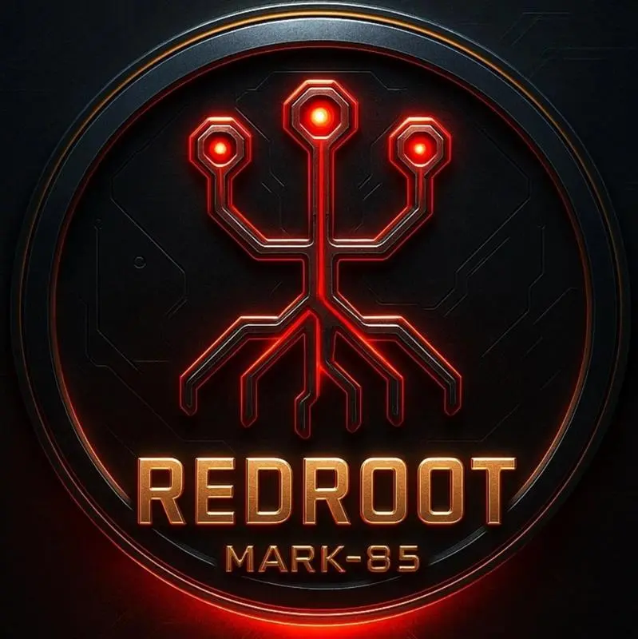

# 🔴 RedRoot Lite – Mark X  
### Offensive Security Framework (Lite Edition | CLI-Based)

> *“Less power. Same discipline.”*

**RedRoot Lite** is the **restricted edition of RedRoot**, designed to provide core red teaming functionality while keeping advanced modules **locked**.

It uses the same architecture, same CLI style, and same mindset — but with **limited access**.

---

## 🚨 What is RedRoot Lite?

RedRoot Lite is a **lightweight, access-controlled version** of the RedRoot framework.

It is intended for:
- Learning and practice  
- CTF environments  
- Safe lab usage  
- Users who only need core modules  

All non-essential and advanced payloads are **disabled**.

---

## ⚙️ Core Capabilities

- CLI-based offensive framework  
- Python-powered  
- Minimal and fast  
- Same structure as RedRoot (Full)  
- Access-controlled module system  

---

## 🧰 Module Access Map (Mark X)

Below is the **module access list** for **RedRoot Lite – Mark X**.

### 🔓 Accessible Modules

- `redrootbreaker` – **Access Granted**  
- `redrootdir` – **Access Granted**  
- `redrootexploit` – **Access Granted**  
- `redrootfuzz` – **Access Granted**  
- `redrootlistener` – **Access Granted**  
- `redrootps` – **Access Granted**  
- `redrootrecon` – **Access Granted**  
- `redrootsniffer` – **Access Granted**  
- `redrootsqli` – **Access Granted**  
- `redrootvenom` – **Access Granted (Payloads Enabled)**  

---

### 🔒 Locked Modules

All remaining RedRoot modules are **locked** in the Lite edition.

This includes:
- Privilege escalation modules  
- Wireless attack modules  
- Active Directory attack chains  
- Backdoor creation  
- Phishing toolkit  
- RedJarvis AI assistant  
- Advanced payload chains  

> Locked modules are visible in the framework but **cannot be executed**.

---

## 🎯 Payload Access (Lite)

- Standard payloads are **enabled**  
- All predefined payloads can be used  
- Advanced payload chaining is **locked**  
- Persistence and stealth payloads are **locked**  

---

## 🤖 AI Update — RedJarvis (Mark 47)

Mark XLVII introduces **RedJarvis**, an integrated AI assistant that brings code-aware, interactive intelligence to RedRoot. This isn't just a scripted helper — it's an AI-powered assistant that understands natural language, reads codebase, and helps plan and run safe operations.

### What RedJarvis does

- **Repository Q&A (RAG):** indexes the codebase with embeddings + FAISS so can ask natural language questions about code and receive answers that cite file paths.
- **Streaming Chat:** interactive, token-by-token responses in a Jarvis-like style (`RedJarvis: Sir, ...`) using local LLMs.
- **Hybrid LLM Backends:** Ollama-first (local LLaMA models) with a Hugging Face transformers fallback.
- **NL → Command:** converts plain English into concrete RedRoot commands (e.g., "scan 10.0.0.0/24 for ssh stealth" → `python -m redrootps --target 10.0.0.0/24 --service ssh --stealth`).
- **Safe Execution:** runs only whitelisted commands, with two execution backends (local or Docker sandbox), timeouts, and daily audit logs.
- **Introspection:** inspects modules and CLI entrypoints, extracts argparse patterns, lists functions and classes.
- **Voice-ready:** architecture supports adding voice input/output so pcan later interact by speech.
- **Developer-focused:** built as a code-aware assistant — helpful for debugging, planning attacks in lab environments, and documenting modules.

## 🧰 Total Red Team Packages (Mark XLVII)

Below is the **complete RedRoot toolset**, mapped directly from the project directory.

### 🔍 Reconnaissance & Enumeration
- `redrootrecon` – Web & target reconnaissance  
- `redrootfinger` – Service and user fingerprinting  
- `redrootwp` – WordPress reconnaissance  
- `redrootfuzz` – Parameter & endpoint fuzzing  
- `redrootdir` – Directory brute forcing  
- `redrootps` – Advanced port scanning  

---

### 🌐 Web Exploitation
- `redrootsqli` – SQL Injection exploitation  
- `redrootxss` – Cross-Site Scripting scanner  
- `redrootlfi` – Local File Inclusion attacks  
- `redrootexploit` – Exploit assistant  

---

### 🧠 Active Directory & Network Attacks
- `redrootldap` – LDAP enumeration  
- `redrootasreproast` – AS-REP Roasting  
- `redrootpoison` – LLMNR / NBT-NS poisoning  
- `redrootbreaker` – Authentication & protocol abuse  

---

### 📡 Wireless & Proximity Attacks
- `redrootevil` – Evil Twin rogue access point  
- `redrootdeauth` – Wi-Fi deauthentication  
- `redrootmitm` – Man-in-the-Middle attacks  
- `redrootbluejack` – Bluetooth Bluejacking  
- `redrootbluesnarf` – Bluetooth Bluesnarfing  

---

### 🔓 Password, Payload & Traffic Attacks
- `redrootvenom` – Payload generation framework  
- `redrootsniffer` – Packet sniffing and capture  
- `redrootdos` – Denial of Service testing  

---

### 🧪 Post-Exploitation & Persistence
- `redrootpriv-esc` – Privilege escalation (Mark XLV upgrade)  
- `redrootlistener` – Reverse shell listener  
- `RedRoot-Backdoor` – Windows/Linux backdoor creator  

---

### 🎭 Social Engineering
- `RedRoot-Phisher` – Phishing framework & launcher  

## 🖥️ Installation

```bash
git clone https://github.com/Agampreet-Singh/RedRoot.git
cd RedRoot
python3 installer.py
```

## 🧠 Why RedRoot Lite?

RedRoot Lite exists to:

- Teach fundamentals  
- Encourage discipline  
- Reduce misuse  
- Provide a safe entry point  

Same mindset.  
Limited reach.

---

## ⚠️ Disclaimer

RedRoot Lite is intended **only for educational and authorized testing purposes**.  
Misuse is strictly prohibited.

---

## 📜 License

MIT License
See the `LICENSE` file for details.

## 🔴 Final Note

RedRoot Lite shows you the tools.  
RedRoot Full shows you the war.

### 🧠 Final Thoughts 

RedRoot isn't just a toolkit — it's a part of me.

You can try to separate me from the framework,  
strip it down to scripts and modules,  
but at the end of the day...

> **I am RedRoot.**

I built it in the command line.  
I debugged it in the dead of night.  
Every scan, every payload, every exploit — it has my fingerprint on it.

So no, it's not just a suit of tools.  
**The tools and I — we’re one.**

🛠️ Built with grit. Run with purpose.  
💻 Hack like you mean it.

### Latest Videos of this Tool 
> **https://instagram.com/th3_redr00t_cyber_security**

### Note
Use this Tool for Educational purpose i am not responsible if you doing any against laws activities

## 🔮 What's Next?

Mark XLVII is here... but this isn't the end.

> One day, there will be a final release — **Mark 85**.

And when **Mark 85** arrives,  
it won’t just be an update...  
it’ll be a **declaration** — the **King of Cybersecurity**.

But don't get me wrong...  
I'm not saying that the god of technology has taken human form for the first time.

I'm just saying... **RedRoot Mark 85** will be close.

> 👑 **IF YOU ARE NOTHING WITHOUT THE REDROOT THEN YOU SHOULDN'T HAVE IT**

> 👑 **Prepare for the legend.**
<p align="center">
  
</p>
